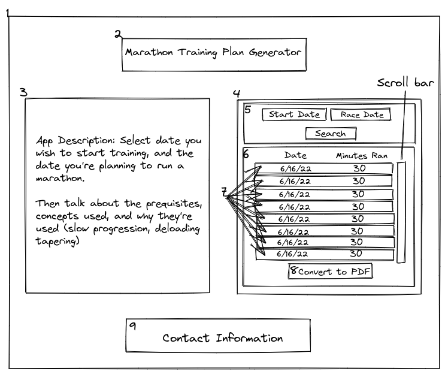
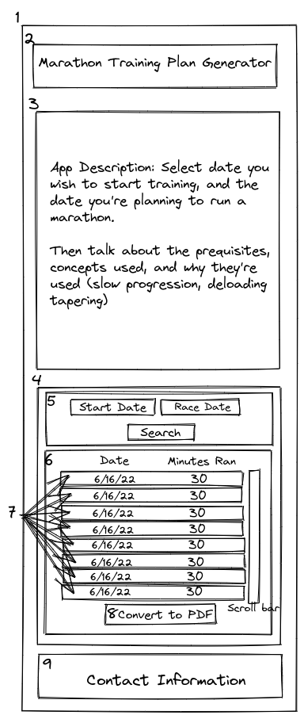

## Marathon Training Plan Generator

## Table of Concepts

- [Overview](#overview)
- [My Process](#my-process)
    - [Challenges](#challenges)
    - [What I learned](#what-i-learned)
    - [Continued Development](#continued-development)
    - [Instructions](#instructions)
- [Author](#author)
- [License](#license)

## Overview 

This is an app which creates marathon training plans. Why create an app if there's already a thousand training plans available online? Most training plans quickly load on mileage, add intensity, and track mileage instead of time spent on feet. While these are concepts yield great results, they make runners susceptive to injury and burnt out - whether it's while training or on race day. This app embraces the philosophy that it's better to be undertrained than overtrained. It aims to prevent injury by incorporating a slow consistent progression tracking time instead of mileage - since a mile in a hilly forest is very different from a mile in a flat city. 

Prior to undertaking this training plan individuals should first consult their healthcare provider. The MVP version of this app makes the assumption that an individual is capable of running 2 hours of per week over 4 or 5 days. If you're not at this level of fitness then talk to your healthcare provider about undertaking something akin to the [Couch to 5k training plan](https://marathonhandbook.com/couch-to-5k-training-plan/).

## My Process

First, I created a mock using [Excalidraw](https://excalidraw.com/), thinking about the design from a mobile-first perspective. Next I broke down the UI into components and subcomponents by keeping the [Single Responsibility Principle](https://en.wikipedia.org/wiki/Single-responsibility_principle). After a couple iterations I found a version I was content with, and numbered the components 1 through 9. 

I named each component, and arranged it in the following hierarchy:

- App (1)
    - Title (2)
    - Description (3)
    - TrainingPlanGenerator (4)
        - DateSelection (5)
        - TrainingPlan (6)
            - TrainingPlanRow (7)
        - PlanToPDFConverter (8)
    - Footer (9)

### Challenges

- Problem: 

    - Solution:  

### What I learned

### Continued Development

### Instructions

## Author

- [Personal Portfolio:](www.mgrigo.com)

## License

This project is licensed under the terms of the MIT license.